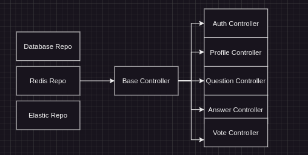
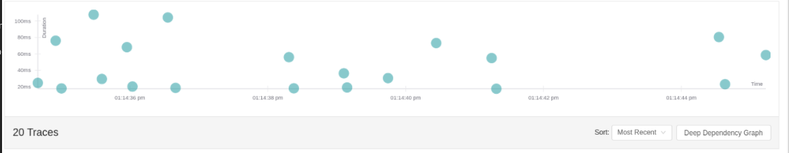
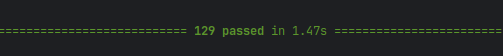

## FastQuora

## Table of Contents
- [Introduction](#introduction)
- [Technologies](#technologies)
- [Monitoring](#monitoring)
    - [OpenTelemetry](#opentelemetry)
- [Application](#application)
    - [Authentication](#authentication)
    - [Profiles](#profiles)
    - [Questions](#questions)
    - [Answers](#answers)
    - [Votes](#votes)
- [Installation](#installation)
    - [Docker Compose](#docker-compose)
    - [Kubernetes](#kubernetes)
- [Run Tests](#run-tests)

## Introduction
FastQuora is a question-and-answer platform like <a href="https://www.quora.com/">Quora</a> that allows users to ask or find questions, answer questions, and vote on answers.
This project comes with a search feature that allows users to search for questions and answers based on keywords. Also, a caching layer is used to increase performance.
<br><br>
This project is using `repository pattern` and handles all operations using repositories and controllers.<br>
This is a high level architecture of the project:<br>


## Technologies
<div>
  
  
  
  
  
  
  
  
  
</div>
<br>
This project uses <a href="https://fastapi.tiangolo.com/">FastAPI</a> as the backend framework, with <a href="https://www.postgresql.org/">PostgreSQL</a> for database management.
In order to provide search functionality, <a href="https://www.elastic.co/">Elasticsearch</a> is used to index and search questions and answers and for increasing performance. It uses <a href="https://redis.io/">Redis</a> as a caching layer.<br>
The application is containerized using <a href="https://www.docker.com/">Docker</a> and orchestrated with <a href="https://kubernetes.io/">Kubernetes</a>.
Also for instrumentation and monitoring, <a href="https://www.jaegertracing.io/">Jaeger</a> is used for distributed tracing and <a href="https://opentelemetry.io/">OpenTelemetry</a> for observability.<br>
For the unit-testing, <a href="https://docs.pytest.org/en/stable/">pytest</a> is used to ensure code quality and reliability.

## Monitoring

### OpenTelemetry
This project comes with monitoring capabilities which are handled by OpenTelemetry. OpenTelemetry is used to collect, process, and export telemetry data such as traces, metrics, and logs.
To visualize the metrics, we use Jaeger in this project.
<br><br>
Here is a sample of the metrics in Jaeger:
<br>


## Application

### Authentication
This project comes with a simple authentication system to allow users to register and login to the platform.
This project is using JWT for authentication to secure the API endpoints.

### Profiles
Users have a right to know who has answered the question, so this project comes with a profile feature that allows users to view other users' profiles as well as changing their own profile to show their best.
Also, this project doesn't collect any personal information from users, so users can be anonymous.

### Questions
The question component is the heart of this project.
It allows users to ask questions, view questions, and update them. Also, thanks to the search feature, users can search for questions based on keywords.

### Answers
The answer component allows users to answer questions, view answers, and update them.

### Votes
The vote system is quite simple.
Users can vote on answers to show their agreement or disagreement with the answer.
Votes are all saved directly in the database.

## Installation
You can run FastQuora either using Docker Compose or Kubernetes in either a local or production environment.

### Docker Compose
To run the application using Docker Compose, follow these steps:
1. Clone the repository
```shell
git clone https://github.com/mohamad-liyaghi/FastQuora.git
```
2. Change to the project directory
```shell
cd FastQuora/
```
3. Run the project
```shell
make run
```
* To run in production mode, use the following command:
```shell
make deploy
```

### Kubernetes
To run the application using Kubernetes, follow these steps:
1. Clone the repository
```shell
git clone https://github.com/mohamad-liyaghi/FastQuora.git
```
2. Change to the project directory
```shell
cd FastQuora/
```
3. Create ConfigMaps
```shell
make local_confmap
```
* To create ConfigMaps for production, use the following command:
```shell
make prod_confmap
```
4. Deploy the application
```shell
make k8s
```

Now project is running on your local machine.
Backend is running on <a href="http://localhost:8000">http://localhost:8000</a> and Jaeger is running on <a href="http://localhost:16686">http://localhost:16686</a>.

## Run Tests
Most parts of the application are covered by unit tests to ensure code quality and reliability.
To run all tests at once, run the following command:
```shell
make test
```

Then You should see the following result:
<br>

